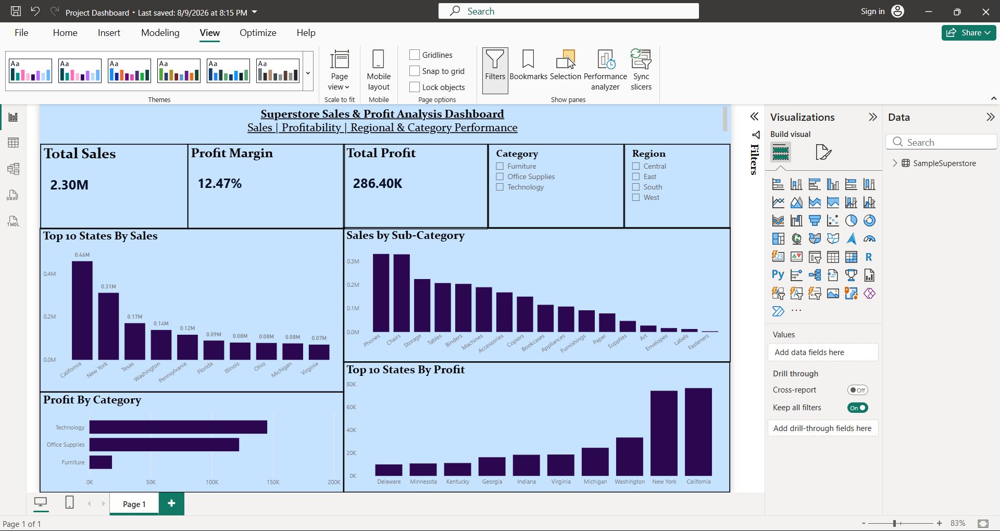

# Superstore Sales & Profit Analysis

##  Project Overview

This project analyzes the Superstore retail dataset to understand **sales performance, profitability, product performance, and regional trends**.

The project combines **Excel, MySQL, and Power BI** to analyze raw sales data, identify business trends, and create an interactive dashboard.

---

## Tools & Technologies

* **Microsoft Excel** — Data analysis and Pivot Tables
* **MySQL** — SQL-based data analysis
* **Power BI** — Interactive dashboard and data visualization

---

##  Dataset

The Superstore dataset contains **9,995 records and 13 columns** covering retail transactions across different:

* States
* Regions
* Categories
* Sub-categories
* Sales
* Profit
* Discount
* Products

---

##  Analysis Performed

### Excel

* Explored and analyzed the dataset
* Used Pivot Tables to summarize sales and profit
* Compared performance across states and categories
* Identified high- and low-performing areas

### MySQL

SQL was used to perform:

* Data filtering using `WHERE`
* Aggregation using `SUM()` and `COUNT()`
* Grouping using `GROUP BY`
* Group-level filtering using `HAVING`
* Sorting using `ORDER BY`
* Limiting results using `LIMIT`
* Conditional classification using `CASE WHEN`
* Table relationships using `JOIN`
* Comparative analysis using subqueries

The SQL analysis focused on **state, category, and sub-category sales and profitability**.

### Power BI

Created an interactive dashboard containing:

* **Total Sales**
* **Total Profit**
* **Profit Margin**
* **Top 10 States by Sales**
* **Profit by Category**
* **Sales by Sub-category**
* **Profit by State**
* **Category slicer**
* **Region slicer**

---

## Key Insights

* **California** generated the highest sales among the states analyzed.
* **Technology** was the strongest-performing category in terms of profit.
* **Phones and Chairs** were among the highest-selling sub-categories.
* Some states generated sales but still experienced **negative profit**.
* High sales do not always result in high profitability, highlighting the importance of analyzing sales and profit together.

---

## Business Recommendations

* Focus marketing efforts on high-performing states while identifying growth opportunities in other regions.
* Investigate loss-making states and products to understand the reasons behind negative profitability.
* Review discount strategies to improve profit margins rather than focusing only on increasing sales.
* Analyze sales and profitability together when making product and regional business decisions.

---

## Power BI Dashboard
Here is the interactive Power BI dashboard created for the project.

---

##  Project Files

| File                          | Description                   |
| ----------------------------- | ----------------------------- |
| `Samplesuperstore.xlsx`        | Excel-based analysis          |
| `Project Dashboard.pbix`       | Power BI dashboard            |
| `Superstore analysis sql.sql`  | MySQL analysis queries        |
| `Dashboard.png`                | Power BI dashboard screenshot |

---

## Project Outcome

This project demonstrates practical skills in:

**Excel • MySQL • Power BI • Data Analysis • Data Visualization • Business Insights**

The project helped transform raw retail data into meaningful insights and an interactive dashboard to support data-driven decision-making.
